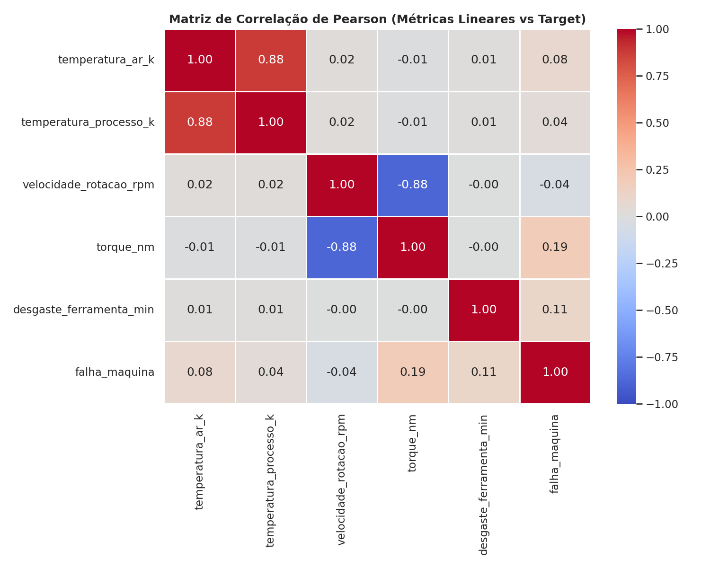
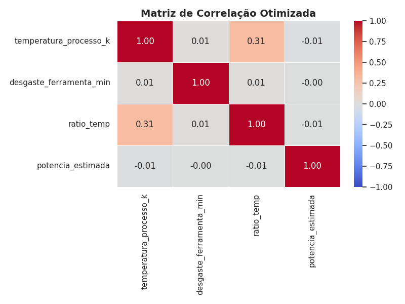
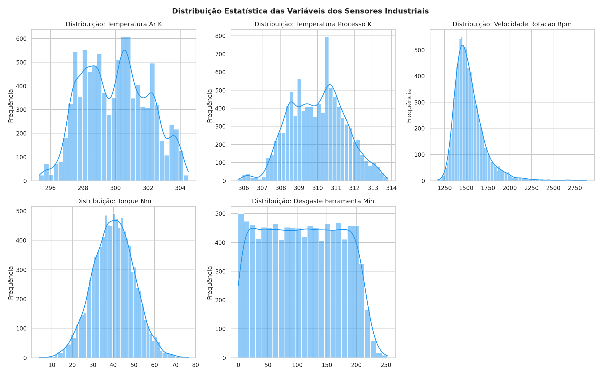
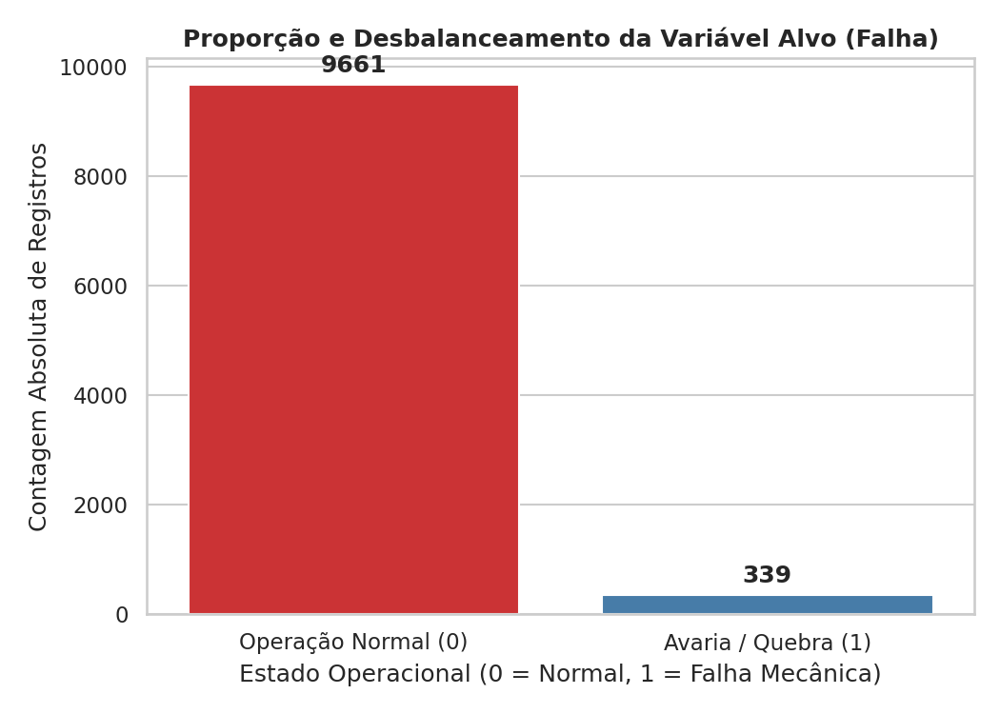
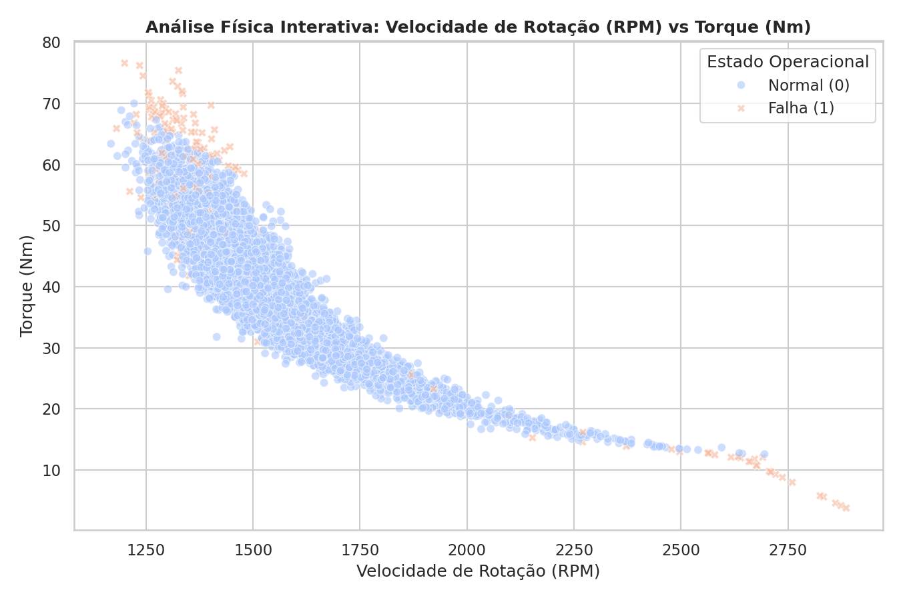
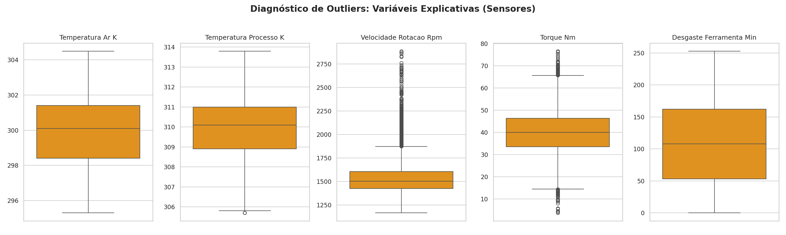

# SMPI-SCTEC -- Sistema de Manutenção Preditiva Industrial

## 1. Escopo do Projeto

O **SMPI-SCTEC** é uma solução inteligente de análise preditiva voltada para a Indústria 4.0. O problema que resolvemos é a **detecção antecipada de falhas em ativos mecânicos**, permitindo que a empresa transite de um modelo de manutenção reativa para um modelo preditivo. Isso reduz drasticamente paradas não planejadas e custos operacionais, aumentando a vida útil dos equipamentos.

## 2. Tecnologias e Técnicas Utilizadas

O projeto utiliza um pipeline completo de Data Science:
* **Linguagens e Ambientes:** Python 3.10+
* **Manipulação e EDA:** `pandas`, `numpy`, `matplotlib`, `seaborn`
* **Machine Learning:** `scikit-learn` (KNN e Árvores de Decisão), `imbalanced-learn` (SMOTE)
* **Pipeline:** Padronização (`StandardScaler`) e Engenharia de Recursos (Cálculo de Potência).

| **Correlação**<br> |

## 3. Como Executar
Siga os passos abaixo para configurar o ambiente e rodar a análise:

```bash
# 1. Cria o ambiente virtual chamado '.venv'
python3 -m venv .venv

# 2. Ativa o ambiente virtual no terminal atual
source .venv/bin/activate

# 3. Atualiza o gerenciador de pacotes interno da venv
pip install --upgrade pip

# 4. Instala todas as dependências na versão correta
pip install -r requirements.txt
```

## Fase 1: Análise Exploratória (EDA)

* **Inspeção dos dados:** Apresentamos as dimensões do dataset (número de linhas e colunas), os tipos de dados das variáveis e o resumo estatístico descritivo das colunas numéricas via método “.describe()”. Os resultados do terminal podem ser vistos ao fim deste arquivo em 'Execução e Diagnóstico Local (Console Output)'. 

* **Gráficos exploratórios:** Geração e exportação automatizada de 4 visualizações analíticas para a pasta `outputs/plots/` utilizando as bibliotecas Matplotlib e Seaborn. Os resultados também podem ser vistos ao fim deste arquivo em 'Execução e Diagnóstico Local (Console Output)'. Temos
  * **Gráfico 1 (Histogramas de Distribuição):** Análise do perfil probabilístico e escalas das 5 variáveis preditoras contínuas (sensores).
  * **Gráfico 2 (Bar Plot de Desbalanceamento):** Quantificação estrita da proporção entre a classe majoritária (Operação Normal - 0) e a minoritária (Falha Mecânica - 1) na variável alvo principal `falha_maquina`.
  * **Gráfico 3 (Heatmap de Correlação de Pearson):** Avaliação de colinearidade focada exclusivamente entre os sensores reais e o target, descartando as colunas de motivos técnicos específicos (`falha_twf`, `falha_hdf`, etc.) para evitar o vazamento de dados (*data leakage*).
  * **Gráfico 4 (Dispersão Física de Operação):** Cruzamento dinâmico entre `velocidade_rotacao_rpm` e `torque_nm` segregados pelo estado de quebra, 
  mapeando visualmente a fronteira física de restrição operacional da máquina.
  * **Restrições das Notas de Engenharia (Conformidade de Dados):** * As colunas de diagnósticos específicos (`falha_twf`, `falha_hdf`, `falha_pwf`, `falha_osf`, `falha_rnf`) foram **excluídas do mapeamento de correlação** e de qualquer futuro vetor de atributos ($X$). 
  * Por representarem o histórico de pós-evento (motivo da quebra), sua inclusão causaria um viés de *data leakage* (vazamento de rótulo), invalidando a capacidade preditiva do modelo em tempo real. Elas permanecem no ecossistema local apenas para fins de auditoria e consulta.

* **Interpretação dos resultados:** Analisamos os valores numéricos e os padrões identificados nos gráficos, explicitando como eles direcionam a estratégia de modelagem. Os resultados também podem ser vistos ao fim deste arquivo em 'Execução e Diagnóstico Local (Console Output)'.

## Fase 2: Limpeza e Tratamento de Dados (Data Prep)

* **Limpeza e Estruturação de Dados:** O script implementa a função `limpar_dados`, que atua como um funil rigoroso de qualidade para garantir a integridade física e matemática do dataset. Suas operações executam sequencialmente:

    * **Remoção de Duplicatas:** Mapeia e elimina registros redundantes utilizando a coluna `udi` (identificador único da peça/motor) como chave de referência restrita.
    * **Padronização Categórica:** Remove espaços em branco residuais (`.strip()`) e uniformiza as strings em letras maiúsculas (`.upper()`) nas colunas identificadoras `id_produto` e `tipo`, garantindo consistência para as próximas fases.
    * **Filtro de Conformidade Física:** Executa uma limpeza rigorosa de anomalias, excluindo da base quaisquer registros que apresentem leituras fisicamente impossíveis para um motor industrial (ex: velocidade de rotação, temperaturas ou torque menores ou iguais a zero). 
    * **Consistência de Tipos (*Type Casting*):** Força a tipagem correta da variável `desgaste_ferramenta_min` para o formato inteiro (`int`), prevenindo erros de alocação de memória e garantindo precisão numérica.
    * **Auditoria de Pipeline:** A função gera um relatório transacional no console que rastreia quantitativamente cada linha alterada ou removida, assegurando transparência no tratamento inicial da base de 10.000 registros.

* **Tratamento de Dados Ausentes:** Foi realizada a identificação de valores nulos no conjunto de dados e aplicada a imputação utilizando métricas de tendência central, com a estratégia selecionada conforme a distribuição de cada variável observada na Análise Exploratória (Fase 1):

    * **Torque (Nm):** Utilizou-se a **Média**, visto que a variável exibe uma distribuição Gaussiana (Normal) simétrica, onde a média representa o valor central com maior precisão estatística.
    * **Velocidade (RPM) e Temperaturas (Ar/Processo):** Utilizou-se a **Mediana**, devido à presença de assimetria e valores extremos (*outliers*) identificados nos histogramas. A mediana assegura robustez, evitando que valores discrepantes distorçam o ponto central da distribuição.

* **Diagnóstico de Outliers:** Foram gerados gráficos do tipo *Boxplot* para as variáveis explicativas, revelando que, enquanto *Temperaturas* e *Desgaste* apresentam distribuições estáveis, as variáveis de *Velocidade (RPM)* e *Torque* concentram *outliers* significativos acima dos limites superiores. 

    * Essa distribuição não indica erros de medição, mas sim estados operacionais críticos: a presença desses valores extremos é a "assinatura" física de sobrecargas mecânicas e instabilidades, sendo essencial manter estes dados preservados para que o modelo aprenda a identificar padrões de falha.
    * O padrão observado nos *boxplots* confirma que a variabilidade dos sensores de *Torque* e *RPM* não é ruído aleatório, mas sim um reflexo da dinâmica operacional do equipamento em condições de esforço. Conclui-se, portanto, que a retenção dos *outliers* é indispensável para o treinamento de um modelo preditivo eficaz, visto que eles representam os limites físicos de operação onde a falha mecânica torna-se estatisticamente provável.

## Fase 3: Feature Engineering

* **Criando Features:** Criamos uma nova coluna numérica por meio de operação matemática entre colunas existentes, tratando os valores nulos previamente. Geramos de novas colunas numéricas baseadas em relações físicas entre sensores existentes.
    * **Implementação:** * `ratio_temp`: Calculada via divisão entre `temperatura_ar_k` e `temperatura_processo_k`. As duas têm correlação muito alta. Levando em conta essa variável, e excluindo `temperatura_ar_k` da análise, a correlação do sistema diminui.
        * `flag_sobrecarga_termica`: Variável binária baseada na mediana da temperatura.
    * **Tratamento:** As operações foram realizadas após a etapa de imputação de nulos da Fase 2, garantindo que nenhum valor `NaN` propagasse erro na divisão matemática.
    * **Output:** Dados enriquecidos salvos em `outputs/dados_enriquecidos.csv`.
    * **Potência Estimada (`potencia_estimada`):** Calculada pela multiplicação entre `velocidade_rotacao_rpm` e `torque_nm`. Representa a potência mecânica do sistema. Variações anômalas nesta métrica, mesmo com RPM constante, indicam falhas iminentes no esforço do motor ou resistência excessiva no corte.

## Fase 4: Divisão e Balanceamento dos Dados

### **Variáveis Preditoras e Alvo**

A etapa de preparação de dados focou em isolar apenas as variáveis que representam estados operacionais da máquina, garantindo que o modelo aprenda padrões físicos e não correlacione dados técnicos de diagnóstico ou identificação.

* **Matriz Preditora (`X`):** Composta por 8 colunas de sensores e métricas derivadas, descritas abaixo:
    * `temperatura_processo_k` (*float64*): Temperatura de operação (Kelvin).
    * `desgaste_ferramenta_min` (*int64*): Tempo de uso acumulado (minutos).
    * `ratio_temp` (*float64*): Razão entre a temperatura do ar e do processo. Ela é capaz de abaixar a correlação do `X` como um todo.
    * `potencia_estimada` (*float64*): Potência calculada a partir de torque e RPM.

A matriz de correlação de $X$ pode ser vista abaixo.

* **Variáveis excluídas:** 
    * `temperatura_ar_k` (*float64*): Temperatura ambiente (Kelvin). Está muito correlacionada à `temperatura_processo_k`, que já carrega a informação térmica crítica. A temperatura do ar é uma variável externa que sofre muito ruído (ex: porta da fábrica aberta).
    * `flag_sobrecarga_termica` (*int64*): Indicador booleano de estresse térmico. Redundante. A árvore de decisão já consegue calcular esse limiar a partir da `temperatura_processo_k` de forma mais precisa que o seu corte fixo na mediana.
    * `velocidade_rotacao_rpm` (*float64*): Velocidade de giro do motor (RPM), e `torque_nm` (*float64*): Força de torção (Nm), pois estão bem anticorrelacionados ($\sim -0.88$). Assim, toda a informação deles está na variável combinação `potencia_estimada` que é o produto dos dois.
    * **Variáveis de Identificação (Excluídas):**
    * `udi`
    * `id_produto`
    * `tipo`

    * **Variáveis de Diagnóstico (Excluídas por orientação do Depto. de Engenharia):**
    * *Justificativa:* Estas colunas representam causas específicas de falha e sua inclusão geraria *Data Leakage* (vazamento de dados), comprometendo a validade preditiva do modelo.
    * `falha_twf` (Tool Wear Failure)
    * `falha_hdf` (Heat Dissipation Failure)
    * `falha_pwf` (Power Failure)
    * `falha_osf` (Overstrain Failure)
    * `falha_rnf` (Random Failures)


* **Variável Alvo (`y`):**
    * `falha_maquina`: Variável binária (0 = Normal, 1 = Falha).

* **Critérios de Limpeza:**
    * **Identificação:** Colunas `udi` e `id_produto` descartadas (não possuem poder preditivo).
    * **Categóricas:** Coluna `tipo` descartada nesta versão para foco em modelos puramente numéricos.
    * **Prevenção de Data Leakage:** Todas as colunas de diagnóstico de falha (`falha_twf`, `falha_hdf`, `falha_pwf`, `falha_osf`, `falha_rnf`) foram rigorosamente removidas, evitando que o modelo tivesse acesso à "causa da quebra" durante o treinamento.

* **Pareto:** Dividimos os dados seguindo o princípio de Pareto, em treino (80%) e teste (20%) utilizando o parâmetro stratify=y.

* **Reamostragem:** Aplicamos uma técnica de reamostragem (SMOTE ou Random Under Sampling) exclusivamente nos dados de treino para evitar o vazamento de dados (Data Leakage).



## Fase 5: Escalonamento de Variáveis (StandardScaler)

* **Abordagem Híbrida:** Aplicamos o StandardScaler apenas nas variáveis contínuas destinadas ao modelo KNN (utilizando fit_transform no treino e transform no teste).
    * **Para KNN (Modelos de Distância):** Aplicação de `StandardScaler` nas variáveis contínuas para equalizar a influência dos sensores no cálculo da distância Euclidiana.
    * **Para Árvores de Decisão:** Os dados foram mantidos sem escalonamento. Como o algoritmo de árvore realiza partições baseadas em limiares (splits) de valores, a normalização é desnecessária e mantê-la preserva a interpretabilidade das features originais.
* **Segurança:** Utilizado `fit_transform` exclusivamente no treino para evitar *data leakage*. Mantemos os dados da Árvore de Decisão sem escalonamento, justificando no código o motivo de o algoritmo ser imune à escala dos atributos.

## Fase 6: Ajuste de Parâmetros e Combate ao Overfitting

* **Treinamento KNN:** Treinamos o modelo variando o parâmetro n_neighbors (K) por no mínimo 3 valores ímpares (ex: K = 3, 5, 7) e registre a acurácia no treino e no teste.
    ```
    [INFO] Iniciando ajuste de hiperparâmetros (KNN)...
    [K=3] Acurácia Treino: 0.9750 | Acurácia Teste: 0.9158
    [K=5] Acurácia Treino: 0.9657 | Acurácia Teste: 0.9021
    [K=7] Acurácia Treino: 0.9569 | Acurácia Teste: 0.9005
    ```
    * **Ponto de Overfitting:** O modelo apresentou sinais claros de overfitting no valor de **K=3**. Embora tenha alcançado a maior acurácia de teste (0.9158), a discrepância de ~6% entre o treino (0.9750) e o teste indica que o modelo estava excessivamente sensível aos ruídos específicos do conjunto de treinamento.
    * **Estabilidade:** A configuração **K=7** garantiu a maior estabilidade. Embora a acurácia absoluta tenha sido marginalmente menor que em K=3, a diferença entre treino e teste diminuiu (0.9569 vs 0.9005), indicando que o modelo tornou-se mais robusto e com melhor capacidade de generalização para dados inéditos.

* **Treinamento Tree:** Treinamos o modelo variando o parâmetro max_depth por no mínimo 3 limites (ex: 3, 5 e None) e registre a acurácia no treino e no teste.
    ```
    [INFO] Iniciando ajuste de hiperparâmetros (Árvore de Decisão)...
    [Depth=3] Acurácia Treino: 0.8562 | Acurácia Teste: 0.8553
    [Depth=5] Acurácia Treino: 0.9073 | Acurácia Teste: 0.8716
    [Depth=None] Acurácia Treino: 1.0000 | Acurácia Teste: 0.9400
    ```
    * **Ponto de Overfitting:** O overfitting crítico foi identificado na configuração `Depth=None`. O modelo atingiu uma acurácia de 100% no conjunto de treino ("memorização"), criando regras excessivamente complexas que, embora mantenham uma boa performance no teste (0.9400), tornam o modelo vulnerável a ruídos em dados futuros. Também podemos identificar um possível underfitting em '[Depth=3] Acurácia Treino: 0.8562 | Acurácia Teste: 0.8553' talvez pelo fato de que o modelo é simples demais para capturar a estrutura real do problema.
    * **Estabilidade:** A configuração **`Depth=5`** garantiu o melhor equilíbrio entre estabilidade e performance. Ela apresenta uma acurácia próxima entre treino (0.9073) e teste (0.8716), demonstrando uma capacidade de aprendizado robusta e uma menor discrepância de generalização em comparação aos extremos de profundidade.

## Fase 7: Avaliação da Acurácia e Veredito Final

* **Acurácia:** Calculamos a acurácia final do melhor KNN e da melhor árvore de decisão utilizando os dados de teste.
    * A avaliação final comparou o modelo KNN (K=3) e a Árvore de Decisão (Depth=5) utilizando o *Classification Report* e a Matriz de Confusão para determinar a eficácia na detecção de falhas industriais.

    ```
    ============================================================
        VEREDITO FINAL: KNN (K=3)
    ============================================================
    [INFO] Classification Report:
                precision    recall  f1-score   support
            0       0.99      0.92      0.95      1836
            1       0.26      0.80      0.39        64

        accuracy                           0.92      1900
    macro avg       0.62      0.86      0.67      1900
    weighted avg       0.97      0.92      0.94      1900

    [INFO] Matriz de Confusão:
    [[1689  147]
    [  13   51]]
    ============================================================

    ============================================================
        VEREDITO FINAL: ÁRVORE (DEPTH=5)
    ============================================================
    [INFO] Classification Report:
                precision    recall  f1-score   support
            0       1.00      0.87      0.93      1836
            1       0.20      0.97      0.34        64

        accuracy                           0.87      1900
    macro avg       0.60      0.92      0.63      1900
    weighted avg       0.97      0.87      0.91      1900

    [INFO] Matriz de Confusão:
    [[1594  242]
    [   2   62]]
    ============================================================
    ```

    * ### Comparação de Taxas de Acerto
        * **Acurácia Global:** O KNN (0.92) apresenta um desempenho superior à Árvore de Decisão (0.87) na métrica de acurácia global. Contudo, devido ao desbalanceamento da base de dados, esta métrica não deve ser o critério principal, pois é inflada pelo alto desempenho na classe majoritária (operação normal).
        * **Recall (Capacidade de Detecção):** A Árvore de Decisão (Recall 0.97) é drasticamente superior ao KNN (Recall 0.80) na detecção da classe de falha (classe 1). Enquanto o KNN permitiu a ocorrência de 13 falhas não detectadas, a Árvore reduziu esse número para apenas 2.

## Conclusão

O modelo selecionado para adoção pela empresa é a **Árvore de Decisão (Depth=5)**. Em sistemas de manutenção preditiva, o objetivo primordial é a minimização de **Falsos Negativos** (falhas catastróficas não detectadas). Embora a Árvore apresente uma precisão menor (gerando mais alarmes falsos, ou Falsos Positivos), ela garante uma cobertura de detecção de falhas de 97%. Para a empresa, o custo operacional de uma checagem preventiva baseada em um alarme falso é infinitamente menor do que o custo de uma falha não prevista que comprometa a integridade dos ativos industriais.

## Melhorias Futuras

* **Modelos Avançados:** Implementar *Random Forest* ou *XGBoost* para impedir o overfitting e conseguir extrair mais nuances dos dados.
* **Dashboard:** Integração com *Streamlit* para tempo real.
* **CI/CD:** Automação de re-treinamento via *GitHub Actions*.

# Execução e Diagnóstico Local (Console Output)

## Resultados Fase 1: Análise Exploratória (EDA)

### Inspeção dos dados

```
[ESTRUTURA] Dimensões do Dataset (Linhas, Colunas): (10000, 14)
[ESTRUTURA] Lista de colunas: ['udi', 'id_produto', 'tipo', 'temperatura_ar_k', 'temperatura_processo_k', 'velocidade_rotacao_rpm', 'torque_nm', 'desgaste_ferramenta_min', 'falha_maquina', 'falha_twf', 'falha_hdf', 'falha_pwf', 'falha_osf', 'falha_rnf']

--- TIPOS DE DADOS DAS VARIÁVEIS ---
udi                          int64
id_produto                  object
tipo                        object
temperatura_ar_k           float64
temperatura_processo_k     float64
velocidade_rotacao_rpm     float64
torque_nm                  float64
desgaste_ferramenta_min      int64
falha_maquina                int64
falha_twf                    int64
falha_hdf                    int64
falha_pwf                    int64
falha_osf                    int64
falha_rnf                    int64
dtype: object

--- VALORES NULOS DETECTADOS POR COLUNA ---
udi                          0
id_produto                   0
tipo                         0
temperatura_ar_k           500
temperatura_processo_k     500
velocidade_rotacao_rpm     500
torque_nm                  500
desgaste_ferramenta_min      0
falha_maquina                0
falha_twf                    0
falha_hdf                    0
falha_pwf                    0
falha_osf                    0
falha_rnf                    0
dtype: int64

--- VISUALIZAÇÃO DOS PRIMEIROS REGISTROS (HEAD) ---
   udi id_produto tipo  temperatura_ar_k  temperatura_processo_k  velocidade_rotacao_rpm  torque_nm  desgaste_ferramenta_min  falha_maquina  falha_twf  falha_hdf  falha_pwf  falha_osf  falha_rnf
0    1     M14860    M             298.1                   308.6                  1551.0       42.8                        0              0          0          0          0          0          0
1    2     L47181    L             298.2                   308.7                  1408.0       46.3                        3              0          0          0          0          0          0
2    3     L47182    L             298.1                   308.5                  1498.0       49.4                        5              0          0          0          0          0          0
3    4     L47183    L               NaN                     NaN                     NaN        NaN                        7              0          0          0          0          0          0
4    5     L47184    L             298.2                   308.7                  1408.0       40.0                        9              0          0          0          0          0          0

--- RESUME ESTATÍSTICO DESCRITIVO (.describe()) ---
               udi  temperatura_ar_k  temperatura_processo_k  velocidade_rotacao_rpm    torque_nm  desgaste_ferramenta_min  falha_maquina     falha_twf     falha_hdf     falha_pwf     falha_osf    falha_rnf
count  10000.00000       9500.000000             9500.000000             9500.000000  9500.000000             10000.000000   10000.000000  10000.000000  10000.000000  10000.000000  10000.000000  10000.00000
mean    5000.50000        300.002158              310.000895             1539.245263    39.974168               107.951000       0.033900      0.004600      0.011500      0.009500      0.009800      0.00190
std     2886.89568          2.001689                1.486432              180.273589     9.995453                63.654147       0.180981      0.067671      0.106625      0.097009      0.098514      0.04355
min        1.00000        295.300000              305.700000             1168.000000     3.800000                 0.000000       0.000000      0.000000      0.000000      0.000000      0.000000      0.00000
25%     2500.75000        298.300000              308.800000             1423.000000    33.100000                53.000000       0.000000      0.000000      0.000000      0.000000      0.000000      0.00000
50%     5000.50000        300.100000              310.100000             1504.000000    40.100000               108.000000       0.000000      0.000000      0.000000      0.000000      0.000000      0.00000
75%     7500.25000        301.500000              311.100000             1613.000000    46.700000               162.000000       0.000000      0.000000      0.000000      0.000000      0.000000      0.00000
max    10000.00000        304.500000              313.800000             2886.000000    76.600000               253.000000       1.000000      1.000000      1.000000      1.000000      1.000000      1.00000
============================================================
```

### Gráficos exploratórios

| Gráficos de Distribuição e Alvo | Matriz e Relação Física |
| :---: | :---: |
| **Gráfico 1: Distribuição**<br> | **Gráfico 2: Desbalanceamento**<br> |
| **Gráfico 3: Correlação**<br> | **Gráfico 4: Dispersão Física**<br> |

### Interpretação dos Resultados: Inspeção Estrutural e Estatística

Com base na varredura inicial do dataset gerada no terminal, identificamos três padrões críticos que guiarão diretamente as próximas etapas de pré-processamento e modelagem da IA:

**1. Padrão de Ausência Síncrona de Dados (Telemetria):**
A função `.isnull().sum()` revelou exatamente **500 valores nulos** concentrados simultaneamente nas quatro colunas de sensores contínuos (`temperatura_ar_k`, `temperatura_processo_k`, `velocidade_rotacao_rpm` e `torque_nm`). O registro de índice 3 na visualização `.head()` confirma esse comportamento. 
* **Direcionamento para Modelagem:** Isso não é um erro aleatório, mas sim um indicativo de queda de rede ou falha no barramento de telemetria da máquina. Na etapa de preparação de dados, precisaremos aplicar técnicas de imputação (como preenchimento pela mediana ou K-NN Imputer) ou remover essas linhas de forma controlada para não quebrar o treinamento dos modelos.

**2. Discrepância Massiva de Escalas Físicas (Impacto Geométrico):**
O resumo `.describe()` expõe uma diferença gritante nas ordens de magnitude das grandezas físicas monitoradas. A velocidade de rotação opera na casa dos milhares (média de **1539 RPM**, máximo de **2886 RPM**), enquanto o torque atua nas dezenas (média de **39.9 Nm**). 
* **Direcionamento para Modelagem:** Como muitos algoritmos de Machine Learning (como K-NN, SVM ou Redes Neurais baseadas em gradiente) calculam distâncias espaciais ou otimizam pesos matemáticos, a grandeza do RPM dominaria completamente a função de custo, "apagando" a influência do torque. É **obrigatória** a aplicação de padronização matemática (ex: `StandardScaler`) no pipeline para colocar todas as variáveis na mesma escala estatística.

**3. Severidade do Desbalanceamento da Variável Alvo:**
A média da variável `falha_maquina` é de **0.0339**. Isso comprova que, de todo o histórico operacional (10.000 registros), apenas **3.39%** (339 linhas) representam eventos reais de falha mecânica. 
* **Direcionamento para Modelagem:** Trata-se de um problema clássico de detecção de anomalias raras. Se treinarmos um classificador sem tratar isso, ele atingirá 96.6% de acurácia apenas "chutando" que a máquina nunca quebra. Por isso, a Acurácia será descartada como métrica principal. O sucesso do projeto será medido pelo **F1-Score** e **Recall**, exigindo o uso de técnicas de reamostragem sintética (como o algoritmo SMOTE) para balancear a classe minoritária durante o treino.

**Gráfico 1: Morfologia e Comportamento Probabilístico dos Sensores (Distribuições):** A análise do Gráfico 1 revela que as variáveis preditoras operam sob regimes estatísticos e físicos completamente distintos. O **Torque** aproxima-se de uma distribuição Normal (Gaussiana) simétrica, indicando um processo mecânico estável centrado em sua média. O **Desgaste da Ferramenta** apresenta uma nítida distribuição Uniforme, o que traduz fielmente o ciclo de vida da peça na fábrica: um acúmulo linear de desgaste temporal (minutos) desde a instalação até o momento limite da troca. Já a **Velocidade de Rotação (RPM)** possui uma forte assimetria à direita (cauda longa), provando que picos extremos de rotação ocorrem, mas são eventos de exceção. Por fim, as **Temperaturas** (Ar e Processo) exibem perfis multimodais (vários picos de frequência), o que sugere que a máquina opera sob diferentes regimes térmicos, possivelmente devido a diferentes turnos, lotes de peças ou flutuações ambientais sazonais. Esta pluralidade morfológica (distribuições normais, uniformes, assimétricas e multimodais) consolida a tese de que algoritmos paramétricos estritos (que assumem normalidade global dos dados) terão dificuldade de generalização. Isso valida fortemente a adoção de algoritmos baseados em árvores de decisão (como Random Forest ou XGBoost). Tais modelos particionam o espaço vetorial de forma não linear, sendo naturalmente robustos e agnósticos tanto à escala quanto ao formato exato das distribuições subjacentes.

**Gráfico 2: Quantificação Visual do Desbalanceamento (Bar Plot da Variável Alvo):** O Gráfico 2 materializa a severidade da assimetria de classes já detectada na inspeção estatística. Observamos uma disparidade esmagadora na distribuição do target: 9.661 registros (96,61%) correspondem à operação normal do ativo, contra apenas 339 ocorrências (3,39%) de falhas mecânicas reais. Esta visualização crava a impossibilidade de treinar modelos preditivos com o dataset cru. Sem intervenção, qualquer algoritmo adotará um viés de classe majoritária para minimizar o erro global, alcançando falsos 96,61% de acurácia simplesmente classificando todos os cenários como "operação normal". Para forçar a IA a aprender os padrões de quebra, a aplicação de técnicas de reamostragem (como o SMOTE) ou o uso de penalidades de peso (*class_weight*) durante a Fase de Modelagem torna-se inegociável. Reafirma-se também a troca da Acurácia por métricas focadas no acerto da classe minoritária, como Recall e F1-Score.

**Gráfico 3: Colinearidade e Redundância Informacional (Matriz de Pearson):** O Gráfico 3 (Heatmap) mapeia as relações lineares do ecossistema da máquina e revela duas fortes zonas de multicolinearidade. Primeiro, há uma correlação positiva severa (**0.88**) entre a Temperatura do Ar e a Temperatura do Processo, indicando redundância termodinâmica. Segundo, confirma-se a fortíssima correlação negativa (**-0.88**) entre a Velocidade de Rotação e o Torque, reflexo direto da restrição de potência do motor. Além disso, notamos que a correlação linear isolada de qualquer sensor com a variável alvo `falha_maquina` é baixíssima (a mais forte é o Torque, com apenas **0.19**). A ausência de fortes correlações preditivas lineares comprova que as falhas são fenômenos complexos, gerados pela interação não linear entre múltiplas variáveis. Algoritmos baseados em regressão linear simples ou regressão logística terão um desempenho muito pobre aqui e sofrerão instabilidade matemática devido à multicolinearidade. Esse cenário exige duas ações práticas: 1) A consolidação das variáveis redundantes na fase de Engenharia de Recursos (ex: calcular o delta térmico entre processo e ar, ou a potência combinada de torque e RPM) para enxugar o vetor $X$; e 2) O uso definitivo de modelos não lineares avançados (como Random Forest, XGBoost ou Redes Neurais), capazes de encontrar os padrões multidimensionais que causam as avarias.

**Gráfico 4: Fronteiras de Falha Físico-Mecânica (Dispersão Torque vs RPM):** A análise visual do Gráfico 4 revela uma correlação inversamente proporcional e não linear entre o Torque e a Rotação, desenhando a curva clássica de restrição de potência do motor. O padrão isolado mais crítico é que as falhas (marcadores em laranja) não ocorrem de maneira aleatória na nuvem de dados, mas sim agrupadas nas bordas extremas do envelope operacional: na zona de alto estresse e travamento (Torque > 60 Nm acoplado a Rotação < 1500 RPM) e na zona de sobrevelocidade ou ruptura (Rotação > 2250 RPM com Torque < 15 Nm). Esse comportamento confirma que as quebras são delimitadas por fronteiras físicas estritas e não lineares. Para capitalizar sobre esse padrão, a etapa de Engenharia de Recursos (*Feature Engineering*) deverá criar uma nova variável combinada capturando essa dinâmica (ex: `potencia_gerada = torque * rpm`). Adicionalmente, o formato de delimitação nas bordas indica que modelos lineares simples terão dificuldade de classificação, reforçando a escolha por algoritmos baseados em árvores (Random Forest, XGBoost) ou SVMs, que lidam excelentemente com fronteiras de decisão espaciais complexas.



**Gráfico 5: Diagnóstico de Outliers:** A análise visual dos boxplots permite concluir que as variáveis **Velocidade de Rotação (RPM)** e **Torque (Nm)** exibem uma quantidade significativa de valores discrepantes (*outliers*), concentrados principalmente acima do terceiro quartil.

* **Variáveis Estáveis:** As variáveis de temperatura (*Temperatura Ar K* e *Temperatura Processo K*) e o *Desgaste da Ferramenta* apresentam uma distribuição contida, sem evidência de anomalias estatísticas que exijam intervenção imediata, mantendo-se dentro dos limites operacionais previstos.
* **Variáveis com Anomalias:**
    * **Velocidade de Rotação (RPM):** Apresenta uma cauda longa de *outliers* superiores, sugerindo períodos de operação em velocidades acima da média nominal.
    * **Torque (Nm):** Apresenta *outliers* em ambas as extremidades, indicando variações bruscas na carga mecânica aplicada ao sistema.

Estes valores discrepantes em RPM e Torque não devem ser removidos do conjunto de dados. No contexto de **manutenção preditiva**, tais anomalias representam estados operacionais críticos (como sobrecarga ou início de falha) que o modelo de IA necessita identificar. A preservação desses dados é essencial para garantir a sensibilidade do modelo na detecção precoce de quebras.
